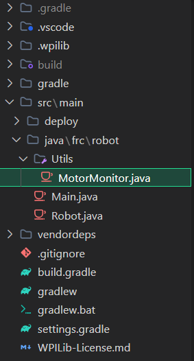

Source code in [our Github](https://github.com/Imcab/MotorMonitor)

# Welcome to Motor Monitor docs!

Motor Monitor, developed by team [#3472](https://www.thebluealliance.com/team/3472) is a class that provides security methods to all the motors in FRC.

With Motor Monitor, the motors now will react to high spike voltages, high current or low battery voltage by the robot, preserving the motor and safe it for an damage. Motor Monitor provides a variety of security protocols according to what fits best for every team.

<a href="https://raw.githubusercontent.com/Imcab/MotorMonitor/main/docs/SourceFile/MotorMonitor.java" download class="md-button md-button--primary">Download file</a>

#### V1.0.2

## **Installation Guide**

!!! warning "Supported Languajes"
    This file is only made in **Java**, C++ or other languajes are **NOT** supported

Motor Monitor is a file that you can add to your robot package. Click on the download button or [here](SourceFile/MotorMonitor.java "download"), move the downloaded file to your robot's **directory** and Thats it!

We recommend **creating a folder in your project** for more organization, in our case we create the folder `\Utils` to save the motor monitor and other utils we made through the season. You should get something like this:

`\java\frc\robot\Utils\MotorMonitor.java`

Now that you get the file and place it in the ideal location we can start to use it through the `MotorMonitor` *class*
