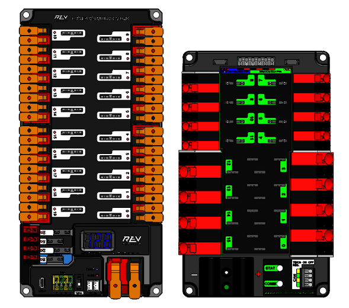

# **Getting Started**

## **Motor Monitor Class**

### **Creating a new MotorMonitor**

Through the `MotorMonitor` class we can perform various types of actions but first, we will initialize a new Motor Monitor for our **motor**

To create a `MotorMonitor` we will need the next parameters:



* Power Distribution System *(PDP)*
* The pdp's channel to check the motor's current

We can do it with the `PowerDristibution` from wpilibj

!!! info
    You need to pass to the constructor the **pdp's channel** that the motor is connected  **NOT** the CAN ID of the motor

=== "Rev"

    ``` java
    PowerDistribution pdp = new PowerDistribution(0, ModuleType.kRev) //Example Rev's pdp with ID 0

    int m_channel = 1; //Motor's pdp channel

    ```

=== "CTRE"

    ``` java
    PowerDistribution pdp = new PowerDistribution(0, ModuleType.kCTRE) //Example CTRE pdp with ID 0

    int m_channel = 1; //Motor's pdp channel

    ```

With the pdp created, we can **now** create our first MotorMonitor like this:

``` java

//Create a new MotorMonitor with the pdp we created above
MotorMonitor m_monitor = new MotorMonitor(pdp, m_channel);
```

### **Set up**

Great! we have our MotorMonitor created, now we need to create the motors we will use. In our case we will create a brushless motor with the `CANSparkMax` class from **REV Robotics** (you can install it from [here](https://docs.revrobotics.com/brushless/revlib/revlib-overview#c++-and-java-installation)), other motors should work the same

``` java

//Creating the motor in CAN ID 1
CANSparkMax m_motor = new CANSparkMax(1, MotorType.kBrushless)

```

We will also create a **Joystick** to interact with our motor, we'll use the `XboxController` class that wpilibj provides us. At the end, we should have something like this:

``` java

PowerDistribution pdp = new PowerDistribution(0, ModuleType.kRev) //Example Rev's pdp with ID 0

int m_channel = 1; //Motor's pdp channel

//Create a new MotorMonitor with the pdp we created above
MotorMonitor m_monitor = new MotorMonitor(pdp, m_channel);

//Creating the motor in CAN ID 1
CANSparkMax m_motor = new CANSparkMax(1, MotorType.kBrushless)

//Creates a XboxController with USB port 0
XboxController controller = new XboxController(0);
```

### **Creating Multiple instances**

!!! Failure "Don't create new PDP's"
    You **DON'T** need to create a new pdp for each `MotorMonitor` you create, you should use the same pdp for **ALL** instances of the `MotorMonitor` you will use

You can create as many `MotorMonitor` as you want for your mechanisms:

``` java

MotorMonitor IntakeMonitor = new MotorMonitor(pdp, intake_channel);

MotorMonitor FlyWheelMonitor = new MotorMonitor(pdp, fly_channel);

MotorMonitor ElevatorMonitor = new MotorMonitor(pdp, elevator_channel);

```

!!! warning
    You **CAN'T** create multiple `MotorMonitor` for a single motor. Each motor will only have an **UNIC** `MotorMonitor` for itself

### **Next Steps**

Now that we have our environment set we can proceed to **configure** our MotorMonitor
